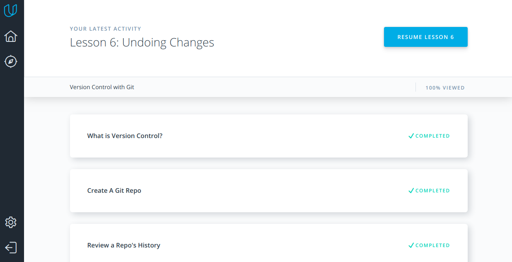
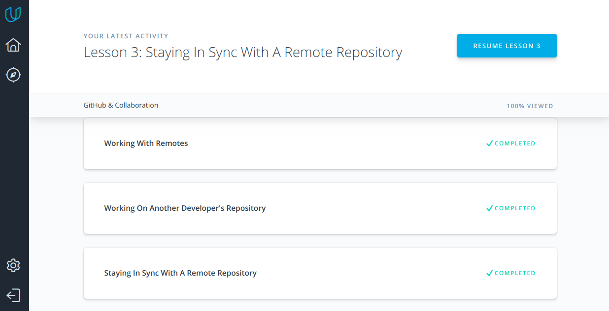

### Git for Team Collaboration

### New
- git reset flags

        --soft
        will take the changes made in the commit  and move them directly to the Staging Index.

        --mixed 
        will take the changes made in the commit and move them to the working directory.

        --hard
        Resets the index and working tree. 

        --merge
        Resets the index and updates the files in the working tree that are different between <commit> and HEAD, but keeps those which are different between the index and working tree (i.e. which have changes which have not been added). If a file that is different between <commit> and the index has unstaged changes, reset is aborted.

        --keep
        Resets index entries and updates files in the working tree that are different between <commit> and HEAD. If a file that is different between <commit> and HEAD has local changes, reset is aborted.

- git rebase --interactive 

        pick 2231360 commit one
        drop ee2adc2 commit two
        Rebase 2cf755d..ee2adc2 onto 2cf755d (9 commands)
        
        Commands:
        p, pick = use commit
        r, reword = use commit, but edit the commit message
        e, edit = use commit, but stop for amending
        s, squash = use commit, but meld into previous commit
        f, fixup = like "squash", but discard this commit's log message
        x, exec = run command (the rest of the line) using shell
        d, drop = remove commit
### Intend to use
- git log --oneline
- git log --author="name"

- git shortlog - list of commits masseges

- git show - full inforamation about last commit 
- git log -p - git show for all history

### Version Control with Git

### GitHub & Collaboration

